## Executive Summary
Comparing casual users with members we find a few notable differences.

-todo

## Who rides most often?
Overall, members take the majority of rides. 

<!-- -->

On weekends however casual use doubles and even exceeds member use. 

<!-- -->

Breaking down the number of rides by month, we can see that while the season
is important for all riders, casual users are much less willing to ride in
the winter months. From December to February, the system sees very little casual use.

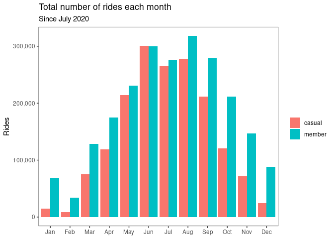<!-- -->

**Summarizing the previous three graphs**, casual use of the system is much
more variable than for members. It is maximized
during summer weekends and minimized during winter weekdays.

## How do trip distances vary?

This is a bit surprising.  For trips that start and end at different stations,
the average trip is about the same distance for
both classes of users, two and a half kilometers.  

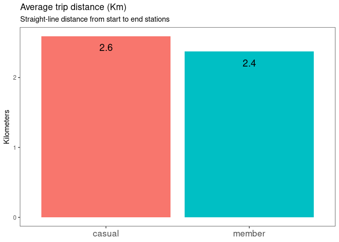<!-- -->

Seasonally, average trip distance is smallest during the winter and largest  
in summer, but only by about half a kilometer.
Trip distance does not change much over the course of the week.

### A special case: pleasure cruises?

For the above analysis we removed trips that start and end 
at the same station since they have an apparent distance of zero. We believe
it's likely that pleasure cruises make up a large portion of these rides.
These rides average an hour long for casual users.
In the 
next section on ride duration we'll see the average of all casual trips is just
over 30 minutes, an interesting difference.

|Rider Type | Possible pleasure cruises| Avg trip minutes| Percent of trips|
|:----------|-------------------------:|----------------:|----------------:|
|casual     |                    315156|               61|        16.029109|
|member     |                    110279|               26|         4.221841|

These round-trips represent about 10% of 
all bike use and about 16% of all casual use. We also see above that casual 
users outnumber members 3 to 1 in this interesting subset of rides.  
We'll return to these trips in a later section, after we have explored
ride duration.

## How much *time* is spent on an average ride?
Casuals ride more than twice as long as members, on average.  There isn't
much variation in ride duration over the week other than a slight increase
on the weekend.

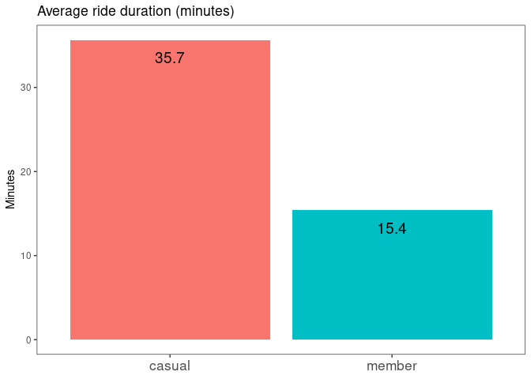<!-- -->

Seasonally, casual rides have a large amount of variation. The small number of
winter trips taken tend to be short - half the length of rides at the peak of summer.

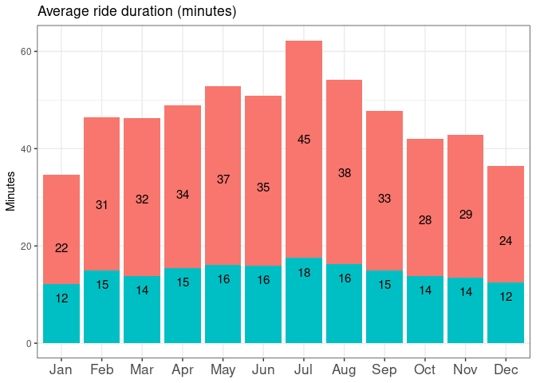<!-- -->

## Pleasure cruises?

Earlier we noted the possibility that 10% of all rides (and 16% of casual
rides) were round-trip
pleasure cruises starting and ending at the same station, likely near the
rider's home. The two graphs below provide more evidence for this idea.

If our hypothesis is correct, the percentage of this type of ride should shrink
in winter and grow in summer and be mostly confined to casual users.  This
first graph shows exactly this pattern.

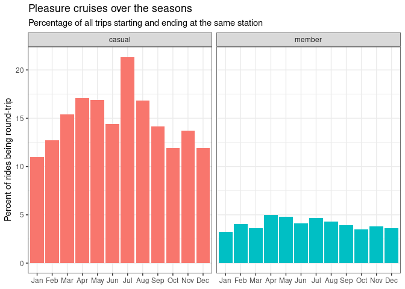<!-- -->

Second, if our idea is correct we should also see trip duration becoming longer
in summer and shorter in winter. This should strongly affect casual users but
have little effect on members, who have a 45-minute time limit.  This graph
demonstrates this pattern as well.

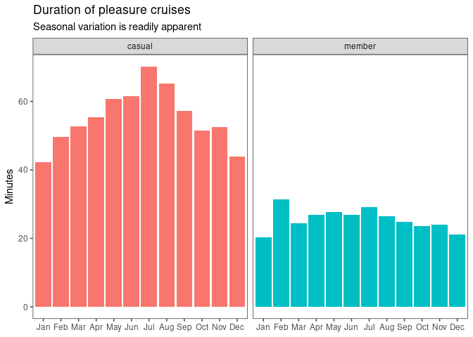<!-- -->

Learning how these rides differ in destination, length, or speed would require 
some sort of GPS tracking data from the bikes, which is outside the scope of 
this dataset.  For now we note the strong possibility that **about ten percent
of all trips are taken for enjoyment rather than travel, and that casual users
dominate this market segment.**

## Speed, Time in the Saddle, Comfort

We've seen that casuals and members ride about the same distances, but members
spend less time on the bikes. The graph below shows that members are about
30% faster on average.

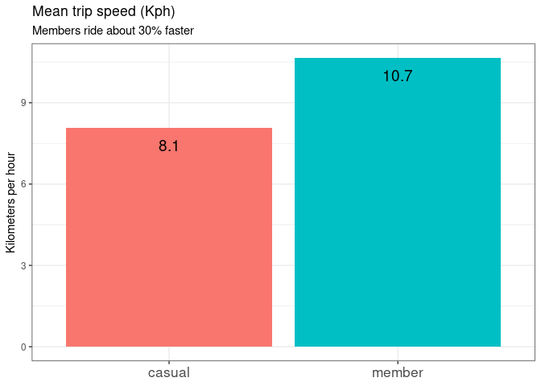<!-- -->

We now know that members ride more often and casuals ride longer: who rides the 
most total minutes?  Casual users do!

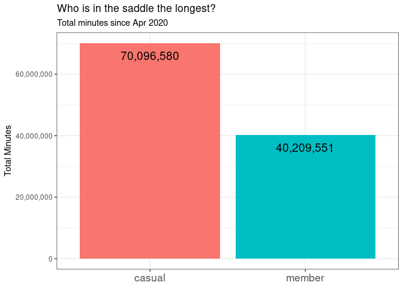<!-- -->

Since casual users spend so much more time in the saddle, it might be a
worthwhile experiment to trial a set of more comfortable, relaxed-ride bikes
aimed at users who want to cruise in comfort.  In the maps section below we
identify regions of the city where casual users dominate the ridership.

## Which stations do casuals use?

We'll look at this question in two parts.  **First** we'll examine who uses
the most and least popular stations.  **Second** we will plot these stations on a
map of Chicago.

### Station popularity

we'll sort the stations
by popularity (number of trips that start there) and colour the points by the
proportion of the type of user.
We can extract three main insights from the  graph below:

1. Overall, most stations are used primarily by members
1. The least popular stations are dominated by casual use
1. A few of the city's most popular stations are over 75% casual use
  - These might make excellent targets for any pilot programs targeting casual
  users

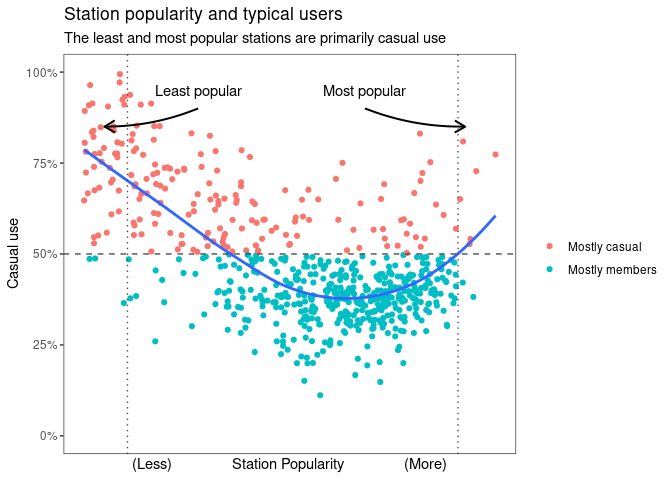<!-- -->

Next we'll map all the bike stations in the system and colour them by the
percentage of casual rides that start there.

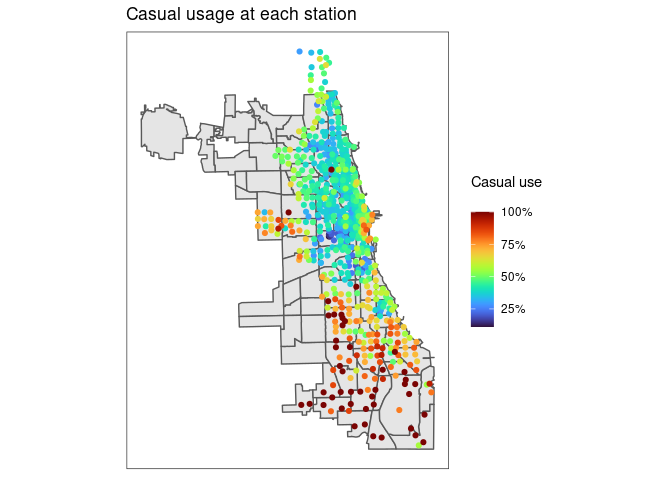<!-- -->

Next let's highlight hot spots.  Any station with over 70% casual use will
be red, and we'll also give busier stations larger dots.

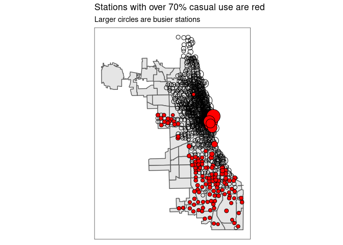<!-- -->

Finally let's zoom in on notable hot spot near Navy Pier.  Of all stations with
over 70% casual use, these are the eight busiest.

## TODO: annotate map with what stations these are

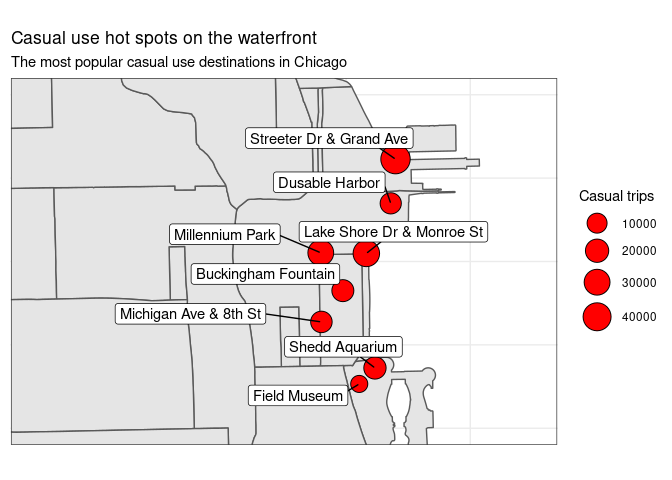<!-- -->

#### Which stations are these?

These stations are all around the waterfront between Soldier Field and
Navy Pier.

|start_station_id |start_station_name        | n_trips_casual| n_trips_station| p_trips_casual| station_lng| station_lat|
|:----------------|:-------------------------|--------------:|---------------:|--------------:|-----------:|-----------:|
|35               |Streeter Dr & Grand Ave   |          47106|           60903|      0.7734594|   -87.61205|    41.89228|
|76               |Lake Shore Dr & Monroe St |          32854|           45142|      0.7277923|   -87.61674|    41.88097|
|90               |Millennium Park           |          29735|           36742|      0.8092918|   -87.62408|    41.88104|
|3                |Shedd Aquarium            |          16636|           22112|      0.7523517|   -87.61536|    41.86723|
|2                |Buckingham Fountain       |          15632|           18812|      0.8309590|   -87.62053|    41.87650|
|623              |Michigan Ave & 8th St     |          14120|           19543|      0.7225093|   -87.62398|    41.87275|
|6                |Dusable Harbor            |          13300|           18977|      0.7008484|   -87.61281|    41.88697|
|13029            |Field Museum              |           4239|            5648|      0.7505312|   -87.61789|    41.86531|

## Traffic Flow
In our last piece of analysis we will examine the overall traffic flow for
patterns exhibited by casual users.

